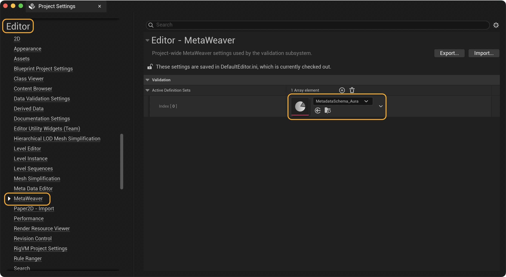
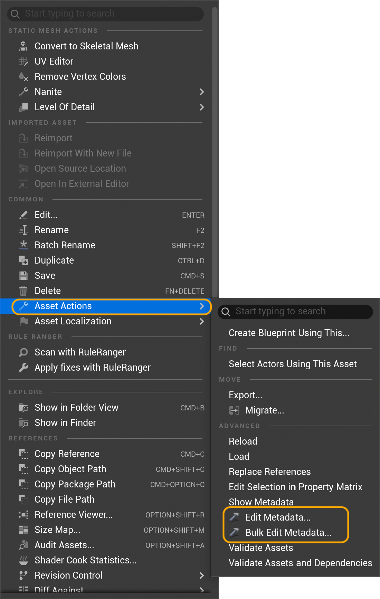
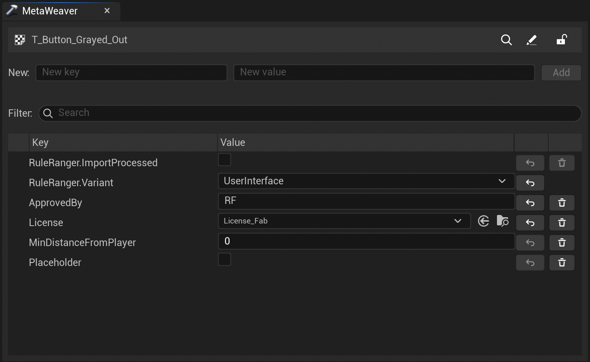
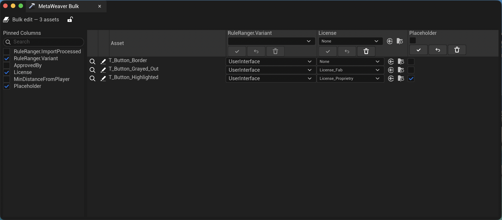
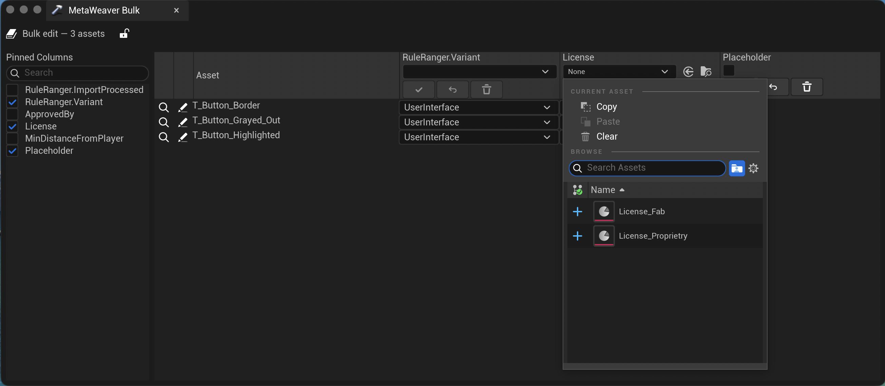
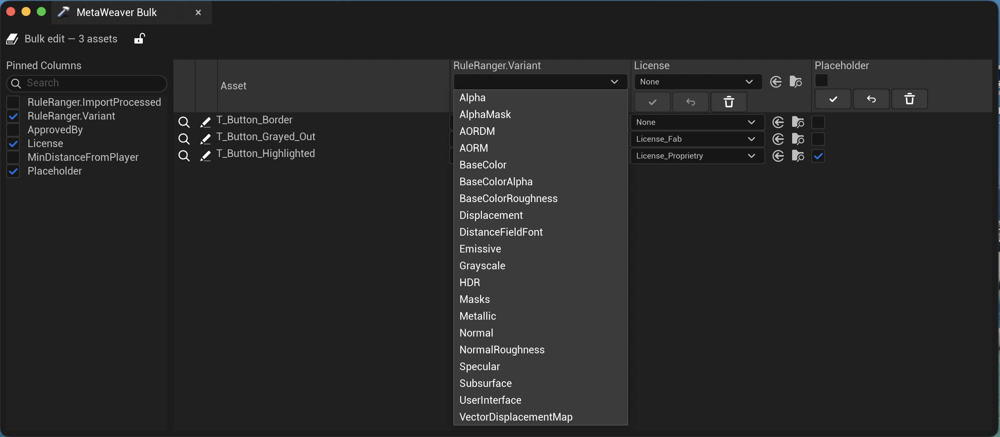

# Getting Started

This guide walks through installing MetaWeaver, enabling definition sets, and using the single‑asset and bulk editors.

## Requirements

- Unreal Engine 5.6+
- Editor‑only plugin (no runtime modules)

## Install

1. Copy the `MetaWeaver` directory into your project’s `Plugins/` folder.
1. Restart the editor. Ensure the MetaWeaver plugin is enabled.

## Configure

1. Project Settings → MetaWeaver → Active Definition Sets
1. Add one or more `UMetaWeaverMetadataDefinitionSet` assets that define your metadata keys and types.

<figure>
  
  <figcaption>Project Settings → MetaWeaver: add one Definition Sets to “Active Definition Sets”.</figcaption>
  </figure>

## Single‑Asset Editing

1. In the Content Browser, right‑click an asset → Asset Actions → Edit Metadata…
    
    <figure>
      
      <figcaption>Content Browser → Asset Actions</figcaption>
    </figure>
1. Edit values using typed controls (Bool, Int, Float, String, Enum, Asset Reference).
1. Inline validation flags missing/invalid values.

<figure>
  
  <figcaption>Single‑asset editor with typed controls and row actions (Show/Open). Include at least one of each type if possible.</figcaption>
</figure>

## Bulk Editing (Matrix)
- Select multiple assets in the Content Browser → Asset Actions → Bulk Edit Metadata…
- Enable columns for keys you want to view/edit. Apply/Reset/Remove per column.
- Row actions include Show in Content Browser and Open Asset Editor.

<figure>
  
  <figcaption>Bulk editor matrix: demonstrate enabling columns, header typed editors, and per‑row Show/Open icons. Avoid pinned columns; capture a simple, scrollable table.</figcaption>
</figure>

<figure>
  
  <figcaption>Asset Reference picker with allowed class filter applied. Show the picker filtering to the permitted types.</figcaption>
</figure>

<figure>
  
  <figcaption>Enum editor dropdown populated from the definition’s string list. Capture values with trimmed, unique entries.</figcaption>
</figure>

## Validation API
Other editor modules can validate assets via the validation subsystem:

```c++
if (GEditor)
{
    if (auto* Subsystem = GEditor->GetEditorSubsystem<UMetaWeaverValidationSubsystem>())
    {
        const auto Report = Subsystem->ValidateAsset(Asset);
        // Inspect Report.Issues …
    }
}
```

## Next Steps
- See [Validation](Validation.md) for enum/exclusive list semantics and error reporting.
- See [FAQ](FAQ.md) for common questions and troubleshooting.

<figure>
  
  <figcaption>Inline validation feedback: show a failed commit with visible error state and tooltip explaining the issue.</figcaption>
</figure>
